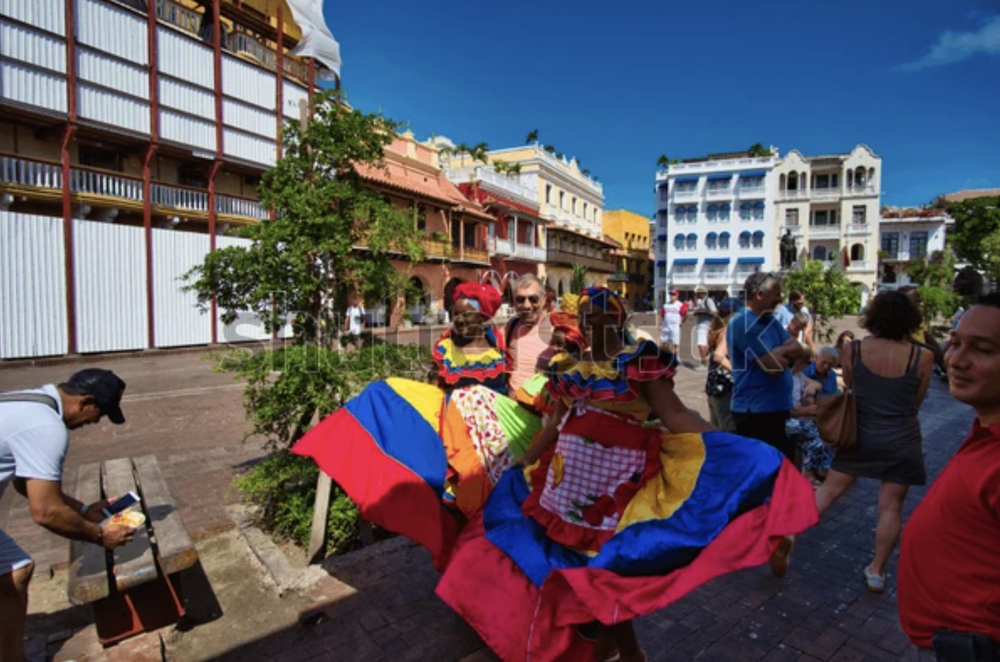

# William Dau Chamat - Sitio Web Oficial

Este es el repositorio del sitio web oficial de William Dau Chamat, ex-alcalde de Cartagena de Indias (2020-2023).

## Descripción

Un sitio web de una sola página (single-page) en español que presenta información sobre la biografía, visión, logros y forma de contacto de William Dau Chamat durante su mandato como alcalde de Cartagena.

## Estructura del Sitio

- **Inicio**: Banner principal con introducción.
- **Biografía**: Información sobre la vida y trayectoria de William Dau Chamat.
- **Visión**: Los pilares de su plan 'Salvemos Juntos a Cartagena 2020-2023'.
- **Logros**: Principales logros durante su mandato.
- **Contacto**: Formulario para enviar mensajes.

## Requisitos Técnicos

- HTML5
- CSS3
- JavaScript (ES6+)
- Fuentes de Google (Montserrat, Open Sans)

## Instrucciones de Instalación

1. Clona este repositorio:
   ```
   git clone https://github.com/yourusername/william-dau-website.git
   ```

2. Navega al directorio del proyecto:
   ```
   cd william-dau-website
   ```

3. Abre el archivo `index.html` en tu navegador preferido o usa un servidor local como Live Server.

## Imágenes

Para el banner principal se recomienda usar una imagen profesional de William Dau Chamat. Se puede encontrar una adecuada en [Shutterstock](https://www.shutterstock.com/image-photo/cartagena-de-indias-colombia-january-06-1627930411).

## Personalización

Para personalizar el sitio:

1. Reemplaza la imagen `images/banner.jpg` con la imagen del banner deseada.
2. Modifica los estilos en `css/styles.css` según sea necesario.
3. Actualiza la información en `index.html` para reflejar cambios o correcciones en el contenido.

## Accesibilidad

Todas las imágenes del sitio incluyen texto alternativo (atributo `alt`) para garantizar la accesibilidad a personas con discapacidad visual. Al agregar o modificar imágenes en el sitio, asegúrate de incluir descripciones claras y concisas en el atributo `alt`.

Ejemplo:
```html

```

## Créditos

- Imágenes: Shutterstock
- Fuentes: Google Fonts

## Licencia

Todos los derechos reservados. © 2024 
